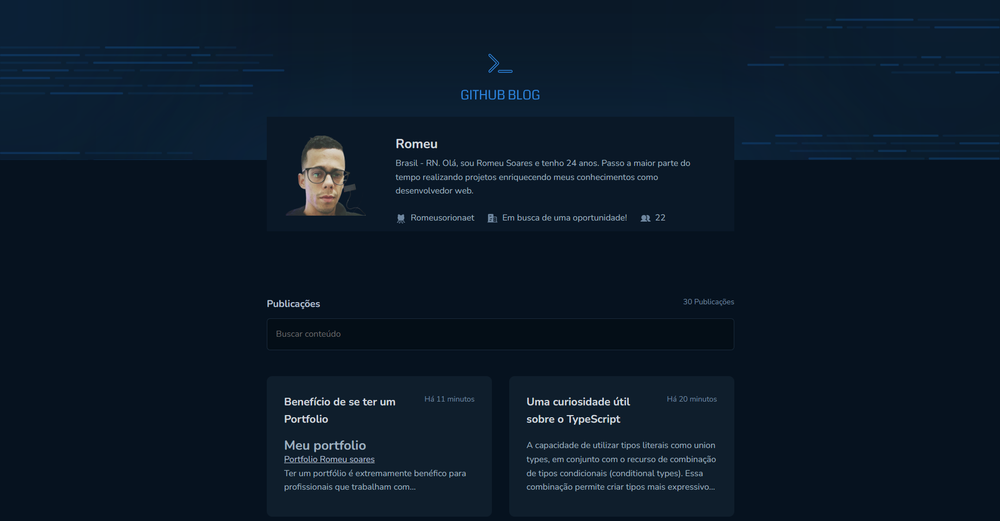

<h1>Github Blog</h1>

[GithubBlog](https://my-github-blog.vercel.app)

Bem-vindo ao Github Blog! Este é um site onde compartilho questões e curiosidades sobre ferramentas de desenvolvimento web. Aqui, você encontrará informações úteis, dicas e truques relacionados ao mundo do desenvolvimento Web

<h2 align='start'>Principais Tecnologias usadas</h2>

 

<ul align='start'>
<li>ReactJS</li>
<li>Vite</li>
<li>TypeScript</li>
<li>HTML</li>
<li>Styled-Components</li>
</ul>

 

Além disso, utilizo diversas bibliotecas e ferramentas adicionais para aprimorar a experiência de desenvolvimento e fornecer recursos adicionais aos leitores. Algumas dessas bibliotecas e ferramentas incluem:

 

<ul align='start'>
<li>Phosphor Icons: Uma biblioteca de ícones SVG moderna e personalizável.</li>
<li>ESLint: Uma ferramenta de análise de código estática que ajuda a identificar e corrigir problemas de código.</li>
<li>date-fns: Uma biblioteca JavaScript para manipulação e formatação de datas.</li>
<li>Axios: Um cliente HTTP baseado em Promises para fazer requisições a APIs.</li>
<li>React Markdown: Uma biblioteca para renderizar conteúdo Markdown em componentes React.</li>
</ul>

 

 

<h2>Problemas e sugestões</h2>

 

Se você encontrar algum problema ou tiver sugestões de melhorias para o Github Blog, por favor, abra uma nova issue neste repositório. Faremos o possível para avaliar e responder prontamente aos problemas e sugestões relatados.

 

<h3>Licença</h3>

O Github Blog é distribuído sob a licença MIT. Para obter mais informações, consulte o arquivo LICENSE.

 

<h2 align='center'> Meus contatos </h2>

 

<ul align='start'>
<li><a href='https://www.linkedin.com/in/romeu-soares-87749a231/'>LinkedIn</a></li>
<li> romeuindexjs@gmail.com</li>
<li> WhatsApp: 84 981127596</li>
</ul>

 

 

Obrigado por visitar o Github Blog! Espero que você encontre conteúdo valioso e interessante relacionado ao desenvolvimento web. Fique à vontade para explorar o site e compartilhar suas dúvidas e opiniões.